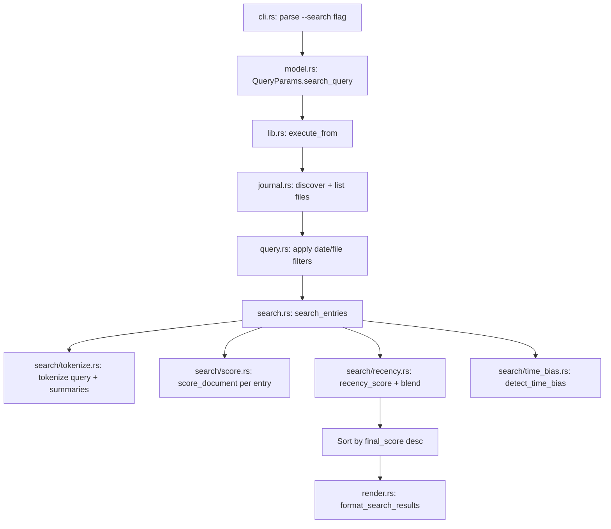

# Design Document

## Overview

Add a `--search <query>` command to the journal CLI that performs ranked keyword search across journal entry summaries. The design introduces a new `search` module containing tokenization, scoring, and recency logic — wired into the existing filter → display pipeline in `lib.rs`.

The scorer runs in-memory with zero external dependencies. It pre-tokenizes summaries on load, then scores each entry against the tokenized query using a composite signal: phrase matching, term frequency, proximity, term order, and time-based recency decay.

## Architecture



### Module Layout

```
src/
├── search/
│   ├── mod.rs          # Public API: search_entries()
│   ├── tokenize.rs     # tokenize(), light_normalize(), STOP_WORDS
│   ├── score.rs        # score_document(), proximity, order
│   ├── recency.rs      # recency_score(), final_score blending
│   └── time_bias.rs    # TimeBias enum, detect_time_bias()
├── search.rs           # Re-export (mod search; pub use search::*)
└── ... existing modules unchanged
```

This follows the existing project convention of flat modules in `src/` with the search submodule being the first multi-file module (justified by its internal complexity and separation of concerns).

## Components and Interfaces

### 1. CLI Extension (`cli.rs`)

Add `--search <query>` flag parsing:

```rust
// In QueryParams (model.rs)
pub search_query: Option<String>,
```

Validation rules:
- `--search` + `--filter` → error (Req 11.2)
- `--search` without value → error (Req 11.1)
- `--search` sets `DisplayMode::Search` (new variant)

### 2. Tokenizer (`search/tokenize.rs`)

```rust
pub static STOP_WORDS: &[&str] = &[...]; // 19 common English stop words

pub fn tokenize(text: &str) -> Vec<String>;
pub fn light_normalize(word: &str) -> String;
```

- Lowercase → split on non-alphanumeric → remove empties → normalize → filter stop words
- `light_normalize`: cheap plural reduction only (Req 2.3)
- Public so it can be called for both query and document text

### 3. Time Bias Detection (`search/time_bias.rs`)

```rust
#[derive(Debug, Clone, Copy, PartialEq)]
pub enum TimeBias {
    Normal,
    Recent,
    Old,
}

pub fn detect_time_bias(query: &str) -> (TimeBias, String);
```

Returns the detected bias AND the cleaned query (bias keywords stripped). This ensures time-bias words don't pollute text scoring (Req 6.3).

### 4. Text Scorer (`search/score.rs`)

```rust
pub fn score_document(
    query_terms: &[String],
    normalized_query_phrase: &str,
    doc_terms: &[String],
) -> f64;

fn smallest_matching_span(query_terms: &[String], doc_terms: &[String]) -> Option<usize>;
fn appears_in_order(query_terms: &[String], doc_terms: &[String]) -> bool;
```

Score components (Req 4.1):
| Signal | Value |
|--------|-------|
| Matched terms | count × 10 |
| Term frequency | total_hits × 2 |
| All-terms bonus | 25 |
| Exact phrase | 75 |
| Proximity | 50 / (1 + span) |
| Order | 10 |

### 5. Recency Scorer (`search/recency.rs`)

```rust
pub fn recency_score(timestamp_unix: i64, now_unix: i64, half_life_days: f64) -> f64;

pub fn final_score(text_score: f64, recency: f64, time_bias: TimeBias) -> f64;
```

Adaptive blending (Req 5.2):

| Text Score Tier | Normal Recency Weight | Recent Weight | Old Weight |
|-----------------|----------------------|---------------|------------|
| ≥ 80 | 0.08 | 0.18 | 0.0 |
| ≥ 40 | 0.15 | 0.30 | 0.0 |
| < 40 | 0.25 | 0.40 | 0.0 |

### 6. Search Orchestrator (`search/mod.rs`)

```rust
pub struct SearchResult {
    pub filename: String,
    pub final_score: f64,
    pub text_score: f64,
    pub recency_score: f64,
    pub summary: String,
}

pub fn search_entries(
    entries: &[(String, PathBuf)],  // (filename, full_path)
    query: &str,
    now_unix: i64,
) -> Vec<SearchResult>;
```

Orchestration flow:
1. `detect_time_bias(query)` → `(bias, cleaned_query)`
2. `tokenize(cleaned_query)` → `query_terms`
3. Early return if `query_terms` is empty
4. For each entry:
   a. Read file content
   b. Extract `## Summary` via `section::extract_section`
   c. `tokenize(summary)` → `doc_terms`
   d. `score_document(query_terms, phrase, doc_terms)` → `text_score`
   e. Parse timestamp from filename → `timestamp_unix`
   f. `recency_score(timestamp_unix, now_unix, 60.0)` → `recency`
   g. `final_score(text_score, recency, bias)` → `score`
5. Filter results where `final_score > 0.0`
6. Sort descending by `final_score`

### 7. Timestamp Extraction

Reuse existing `journal.rs::extract_date_prefix` / `extract_timestamp_prefix` logic. Convert the `YYYY-MM-DD-HHmm` prefix to a Unix timestamp for recency calculation. Add a helper:

```rust
// In journal.rs or search/recency.rs
pub fn filename_to_unix_timestamp(filename: &str) -> Option<i64>;
```

Parse year/month/day/hour/minute from the filename prefix. Use a naive UTC conversion (sufficient for relative age calculation).

### 8. Render Extension (`render.rs`)

```rust
pub fn format_search_results(results: &[SearchResult], limit: usize) -> String;
```

Output format per result:
```
[score] filename
  summary_preview...
```

Example:
```
[87.25] 2026-05-04-1200-add-student-notes.md
  Added notes that the owner can send to students or instructors.

[34.10] 2026-05-03-1000-student-login.md
  Students can now log in to the platform using SSO.
```

### 9. Pipeline Integration (`lib.rs`)

The existing flow:
```
parse_args → discover → list → apply_filters → truncate(latest) → display
```

Becomes:
```
parse_args → discover → list → apply_filters → IF search: search_entries → truncate(latest) → format_search_results
                                                ELSE: existing flow
```

The search runs on the already-filtered entry list, so `--since`, `--between`, and `--files` still narrow the corpus before scoring.

## Data Models

### Extended `QueryParams` (`model.rs`)

```rust
pub struct QueryParams {
    pub display_mode: DisplayMode,
    pub files_query: Option<String>,
    pub since: Option<String>,
    pub between: Option<(String, String)>,
    pub filter_terms: Vec<String>,
    pub search_query: Option<String>,  // NEW
    pub latest: Option<usize>,
    pub help_requested: bool,
}
```

### Extended `DisplayMode` (`model.rs`)

```rust
pub enum DisplayMode {
    List,
    Full,
    Summary,
    TypeSection(String),
    Search,  // NEW
}
```

### Internal Search Structures (`search/mod.rs`)

```rust
struct TokenizedEntry {
    filename: String,
    summary: String,
    summary_terms: Vec<String>,
    timestamp_unix: i64,
}
```

Pre-tokenized in one pass, then scored. Satisfies Req 9.1 (tokenize once).

## Error Handling

| Condition | Behavior | Requirement |
|-----------|----------|-------------|
| `--search` without value | Print error, exit 1 | Req 11.1 |
| `--search` + `--filter` | Print mutual exclusion error, exit 1 | Req 11.2 |
| Query reduces to empty after stop-word removal | Return empty results, exit 0 | Req 11.3 |
| Entry file unreadable | Skip entry (consistent with existing `--filter` behavior) | Existing pattern |
| Entry has no `## Summary` | Skip entry, score = 0 | Req 3.2 |
| Filename timestamp unparseable | Use epoch 0 (maximum age, minimal recency boost) | Graceful degradation |

## Testing Strategy

Unit tests per submodule:
- `tokenize.rs`: stop word removal, normalization, edge cases (all stop words, empty input, unicode)
- `score.rs`: each signal in isolation, combined scoring, single-term queries
- `recency.rs`: decay curve values at known ages, adaptive weight tiers, zero text score
- `time_bias.rs`: keyword detection, stripping, edge cases
- `search/mod.rs`: integration across the pipeline with fixture entries

Integration tests in `lib.rs`:
- `--search` basic usage
- `--search` combined with `--since`
- `--search` + `--filter` → error
- `--search` with all-stop-word query → empty results
- `--search` + `--latest` → capped results

## Key Design Decisions

1. **New module, not inline in `query.rs`**: The search logic is complex enough (5+ source files) to warrant its own `search/` submodule rather than growing `query.rs`.

2. **`--search` mutually exclusive with `--filter`**: They solve different problems. `--filter` is a quick boolean pass/fail for piping. `--search` is scored ranking. Mixing them adds complexity without clear user value.

3. **Summary-only scoring**: Scoring the entire file content would dilute relevance (boilerplate section headers would match). The Summary is the most semantically dense section.

4. **Adaptive recency weights**: Strong text matches shouldn't lose to newer-but-weaker matches. The tiered weighting prevents recency from overpowering relevance.

5. **Time-bias stripped from query**: Words like "recent" are search modifiers, not content terms. Keeping them would penalize entries that don't literally contain "recent" in their summary.

6. **Naive UTC timestamp**: The journal uses local time in filenames but we only need relative age (days between entries). Treating all timestamps as UTC is sufficient for the decay calculation.
