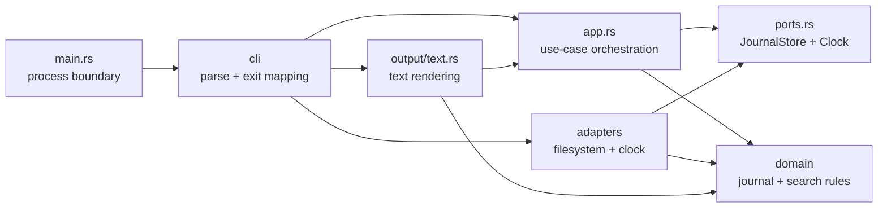
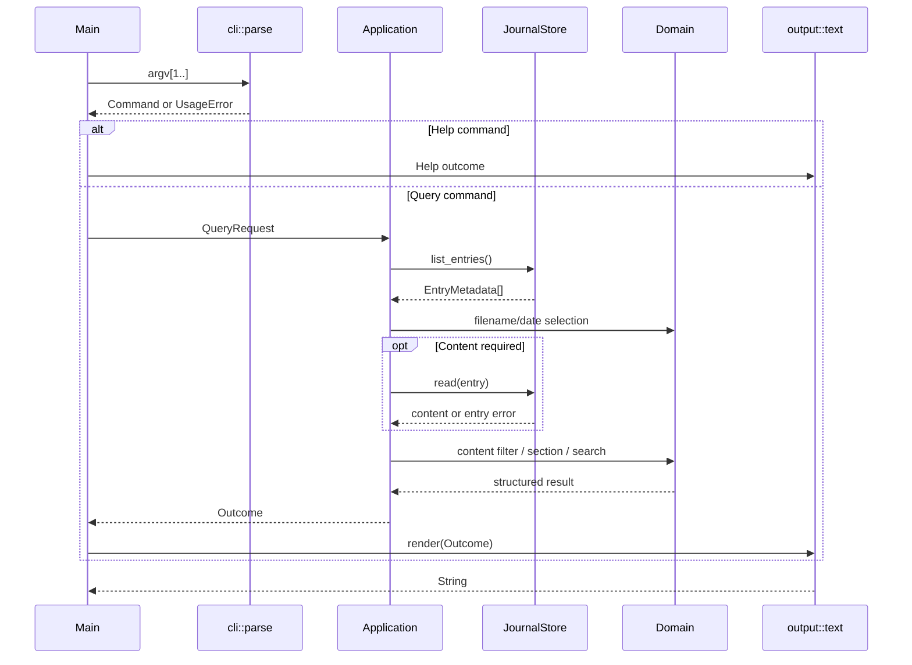

# Design Document — Journal CLI Architecture Refactor

## Overview

This design restructures the Journal CLI without changing its user-visible feature set. The crate remains a synchronous, standard-library-only Rust 2024 package. The refactor separates process concerns, CLI parsing, application orchestration, pure journal/search rules, external side effects, and text presentation while retaining the current `journal` binary and its behavior.

The existing code already has useful seams: `main.rs` is thin, rendering is mostly isolated, section extraction is pure, and search scoring is split into focused modules. The changes concentrate on boundaries that are currently crossed:

- `lib.rs` owns environment access, system time, filesystem-driven orchestration, search dispatch, and rendering.
- `journal.rs` mixes filesystem operations with pure filename and date rules.
- `query.rs` mixes pure predicates with entry reads and read-error caching.
- `search/mod.rs` reads files directly and obtains domain input itself.
- `QueryParams` represents several incompatible states through optional fields.
- application-level tests depend on temporary files, and there are no process-level stdout/stderr/exit-code contract tests.

The result is intentionally smaller than a full clean-architecture framework. It introduces two external ports (`JournalStore` and `Clock`), one application pipeline, pure domain modules, and one text output adapter. It does not introduce a workspace, async runtime, parser crate, error crate, serialization format, or new command.

## Architecture

### Target Source Layout

```text
src/
├── main.rs
├── lib.rs
├── app.rs
├── error.rs
├── ports.rs
│
├── cli/
│   ├── mod.rs
│   ├── parse.rs
│   ├── help.rs
│   └── exit.rs
│
├── domain/
│   ├── mod.rs
│   ├── entry.rs
│   ├── filename.rs
│   ├── query.rs
│   ├── section.rs
│   └── search/
│       ├── mod.rs
│       ├── tokenize.rs
│       ├── score.rs
│       ├── recency.rs
│       └── time_bias.rs
│
├── adapters/
│   ├── mod.rs
│   ├── fs_journal.rs
│   └── system_clock.rs
│
└── output/
    ├── mod.rs
    └── text.rs

tests/
├── application.rs
├── cli_contract.rs
├── common/
│   └── mod.rs
└── fixtures/
    └── journal/
```

`app.rs`, `error.rs`, and `ports.rs` remain single files because each boundary is expected to stay small. Directories are used only where a responsibility has multiple cohesive parts.

### Dependency Direction



The dependency rules are:

1. `domain` imports only the Rust standard library and other domain modules.
2. `ports` may refer to domain types but not adapters, CLI, or output.
3. `app` depends on domain types and ports, never concrete filesystem or clock implementations.
4. `adapters` implement ports and may use `std::fs`, `std::env`, `std::path`, and `std::time`.
5. `output` formats application outcomes and domain DTOs but performs no I/O.
6. `cli` owns argument compatibility, help, process-facing diagnostics, and composition of real adapters.
7. `main.rs` does not contain application rules.

This addresses Requirements 2, 4, and 5.

### Runtime Flow



The application owns one invocation-scoped content cache keyed by `EntryName`. This preserves lazy reads while preventing `--filter`, section extraction, full display, or search from reading the same file more than once during an invocation (Requirement 6.9).

## Components and Interfaces

### `main.rs`

`main.rs` remains a disposable process adapter:

```rust
fn main() {
    let args: Vec<String> = std::env::args().skip(1).collect();
    let execution = journal::run_cli(&args);

    if let Some(output) = execution.stdout {
        println!("{output}");
    }
    if let Some(diagnostic) = execution.stderr {
        eprintln!("{diagnostic}");
    }

    std::process::exit(execution.exit.code());
}
```

The actual signature may accept `Vec<String>` to remain consistent with the current parser. `main.rs` itself contains no command dispatch, journal discovery, filtering, searching, or formatting logic.

### `lib.rs`

`lib.rs` declares internal modules and exposes only the stable crate surface. The existing `journal::run(&[String])` entrypoint may remain as a convenience façade, but it will delegate to CLI composition and return a typed error. Internal search implementation modules will no longer be public merely to support intra-crate calls.

Expected surface:

```rust
pub use app::{Application, Outcome};
pub use cli::{CliExecution, ExitStatus};
pub use error::{AppError, AppResult};
pub use ports::{Clock, JournalStore};

pub fn run(args: &[String]) -> AppResult<String>;
pub fn run_cli(args: &[String]) -> CliExecution;
```

`cli` itself may remain private; `CliExecution` and `ExitStatus` are intentional re-exports used by the binary. `run_cli` composes the real current-directory, filesystem, and clock adapters, renders the result, and converts it into separate stdout/stderr payloads plus an exit status. `run` remains the reusable convenience path for callers that want the successful rendered value or typed error without process routing.

The binary remains the primary compatibility surface. The crate is at version `0.1.0`, so replacing `Result<String, String>` with a typed error is acceptable inside this architecture refactor and will be recorded in the README if the library surface is documented.

### CLI Parsing (`cli/parse.rs`)

The parser preserves the current hand-written, zero-dependency implementation but maps input directly into valid request types. Parsing remains separate from execution.

Responsibilities:

- recognize current flags, positional commands, aliases, and bare file prefixes;
- collect syntactic values such as non-zero counts;
- invoke domain constructors for date/timestamp and range validation;
- enforce mutual exclusions;
- return `Command::Help` or `Command::Query(QueryRequest)`;
- preserve current diagnostic wording unless an existing test establishes a more exact string.

No parser branch reads the filesystem or system clock.

### Help and Exit Mapping (`cli/help.rs`, `cli/exit.rs`)

`cli/help.rs` retains the baked-in help text so runtime behavior has no extra file dependency. `cli/exit.rs` maps typed errors to user-facing diagnostics and the current exit policy:

| Condition | stdout | stderr | Exit |
|---|---|---|---:|
| Successful result | rendered outcome | empty | 0 |
| Help | help text | empty | 0 |
| No journal entries | `No journal entries found.` | empty | 0 |
| No search matches | `No matching entries found.` | empty | 0 |
| Usage/validation error | empty | current error text | 1 |
| Fatal current-directory/store error | empty | actionable error text | 1 |

A future feature may introduce a richer exit-code policy, but this refactor does not change it (Requirements 1 and 7).

### Application (`app.rs`)

The application is generic over the two ports:

```rust
pub struct Application<S, C> {
    store: S,
    clock: C,
}

impl<S, C> Application<S, C>
where
    S: JournalStore,
    C: Clock,
{
    pub fn execute(&self, request: QueryRequest) -> AppResult<Outcome>;
}
```

Execution order:

1. List valid entry metadata from the store.
2. Apply filename-prefix and date/time-window predicates.
3. If content filtering is active, load each remaining entry once and retain matches plus read failures according to current behavior.
4. For search, extract non-empty summaries, score against `clock.now_unix()`, sort, and truncate to `latest` or ten.
5. For non-search output, apply `latest`; if no explicit view was selected, use Summary.
6. Produce a structured `Outcome`.

Per-entry read failures are data in non-search outcomes, not fatal application errors. Search preserves current behavior by skipping unreadable or summary-less entries. Failure to establish the current directory or enumerate the selected journal directory is a fatal typed error.

### Domain Entry and Filename (`domain/entry.rs`, `domain/filename.rs`)

`EntryName` validates the storage identity and prevents paths from entering domain/application APIs:

```rust
pub struct EntryName(String);

impl EntryName {
    pub fn parse(value: impl Into<String>) -> Result<Self, DomainError>;
    pub fn as_str(&self) -> &str;
    pub fn date(&self) -> JournalDate;
    pub fn timestamp(&self) -> Option<JournalTimestamp>;
}

pub struct EntryMetadata {
    pub name: EntryName,
    pub date: JournalDate,
    pub timestamp: Option<JournalTimestamp>,
}
```

`EntryName::parse` accepts only a filename, not a path. It requires `.md`, a valid date prefix, and no `/`, `\\`, `.`/`..` path components, or platform path prefix. Date and timestamp types retain lexicographically sortable normalized forms. Calendar validation remains aligned with current behavior unless an existing test proves otherwise; the refactor does not silently broaden or tighten normal accepted CLI values.

### Domain Query (`domain/query.rs`)

Pure request and selection types:

```rust
pub enum Command {
    Help,
    Query(QueryRequest),
}

pub struct QueryRequest {
    pub selection: EntrySelection,
    pub view: View,
    pub limit: Option<NonZeroUsize>,
}

pub struct EntrySelection {
    pub file_prefix: Option<String>,
    pub window: Option<DateWindow>,
    pub content_terms: Vec<String>,
}

pub enum DateWindow {
    Since(JournalMoment),
    Between { start: JournalMoment, end: JournalMoment },
}

pub enum View {
    List,
    Full,
    Section(SectionName),
    Search(SearchQuery),
}
```

`Summary` is represented as `View::Section(SectionName::summary())`; the parser remembers whether the user explicitly selected a view so that `--latest` can retain its default-to-summary behavior. This can be implemented with an `ExplicitView` flag on `QueryRequest` or a constructor that resolves the final view during parsing. Search contains its non-empty raw query, eliminating `DisplayMode::Search` plus `search_query: None`.

### Domain Section (`domain/section.rs`)

The existing pure extraction logic moves with its tests. It continues to:

- normalize CRLF to LF;
- match H1 and H2 headings case-insensitively;
- stop at the next H1 or H2 boundary;
- map `Issues` and `Unknowns` to `Issues / Unknowns`;
- return `None` for missing sections.

### Domain Search (`domain/search/`)

Search receives prepared data instead of file paths:

```rust
pub struct SearchCandidate<'a> {
    pub entry: &'a EntryMetadata,
    pub summary: &'a str,
}

pub struct SearchMatch {
    pub entry: EntryMetadata,
    pub final_score: f64,
    pub text_score: f64,
    pub recency_score: f64,
    pub summary: String,
}

pub fn rank(
    candidates: &[SearchCandidate<'_>],
    query: &SearchQuery,
    now_unix: i64,
) -> Vec<SearchMatch>;
```

`rank` coordinates the existing pure tokenizer, scorer, recency function, and time-bias detector. It does not import `std::fs` or accept a directory path. Score ties use a deterministic filename fallback after comparing final score so output ordering does not depend on unstable iteration behavior.

### Ports (`ports.rs`)

Only external capabilities needed for substitution become traits:

```rust
pub trait JournalStore {
    fn list_entries(&self) -> Result<Vec<EntryMetadata>, StoreError>;
    fn read_entry(&self, entry: &EntryName) -> Result<String, StoreError>;
}

pub trait Clock {
    fn now_unix(&self) -> i64;
}
```

The store is constructed with its current-working-directory context. This keeps the cwd discovery rule in the adapter and keeps the application unaware of paths. Missing `.journal`/`journal` storage returns an empty list, preserving the successful empty-state contract.

### Filesystem Adapter (`adapters/fs_journal.rs`)

`FsJournalStore` owns:

- the caller-supplied current working directory;
- `.journal` then `journal` discovery;
- valid Markdown entry enumeration;
- newest-first deterministic sorting;
- contained, UTF-8 file reads;
- conversion of `std::io::Error` into `StoreError`.

For contained reads, the adapter joins only a validated `EntryName` to the discovered journal root. It canonicalizes the root and candidate when possible and confirms that the candidate remains under the canonical root before reading. An entry that resolves outside the root is rejected. The adapter never accepts raw user path input.

### System Clock Adapter (`adapters/system_clock.rs`)

`SystemClock` converts `SystemTime::now()` to Unix seconds. It preserves the current practical fallback of `0` if the clock reports a pre-epoch duration error. Tests use `FixedClock` instead.

### Text Output (`output/text.rs`)

The text renderer consumes outcomes only:

```rust
pub fn render(outcome: &Outcome) -> String;
```

Outcome variants distinguish grouped listings, entry blocks, and ranked search results. Constants for exact empty-state and no-match messages live in the presentation boundary rather than filesystem modules. The renderer preserves current blank lines, indentation, two-decimal scores, 120-character search previews, and missing-section fallback wording.

## Data Models

### Application Outcome

```rust
pub enum Outcome {
    Help,
    EntriesNotFound,
    Listing(Vec<EntryMetadata>),
    Blocks(Vec<EntryBlock>),
    Search(Vec<SearchMatch>),
}

pub struct EntryBlock {
    pub entry: EntryMetadata,
    pub body: EntryBody,
}

pub enum EntryBody {
    Content(String),
    ReadError(String),
}
```

`Outcome` is presentation-neutral: it does not include indentation, delimiters, formatted scores, or stdout/stderr decisions.

### Invocation Content Cache

The application may use:

```rust
BTreeMap<EntryName, Result<String, StoreError>>
```

or an equivalent private helper. `EntryName` therefore derives `Eq`, `Ord`, and `Clone`. A `BTreeMap` keeps diagnostics and iteration deterministic and requires no dependency.

### Storage Model

There is no database and no persistent application state. Markdown files remain the source of truth. The refactor neither migrates nor rewrites journal entries.

## Error Handling

Typed errors are implemented with `std::fmt::Display` and `std::error::Error`:

```rust
pub enum AppError {
    Usage(UsageError),
    CurrentDirectory(std::io::Error),
    Store(StoreError),
}

pub enum UsageError {
    UnknownOption(String),
    MissingValue(&'static str),
    InvalidDate(String),
    InvalidRange,
    InvalidLimit,
    ConflictingOptions(&'static str, &'static str),
}

pub enum StoreError {
    Discover { path: PathBuf, source: std::io::Error },
    List { path: PathBuf, source: std::io::Error },
    Read { entry: EntryName, source: std::io::Error },
    EscapesRoot(EntryName),
}
```

No production path uses `unwrap()` or `expect()`. A whole-command error becomes stderr plus exit `1`. A per-entry read failure becomes `EntryBody::ReadError` for non-search modes, allowing other entries to render. Search skips the failing candidate exactly as it does today. Missing storage or an empty set is a successful outcome.

## Security Considerations

- User arguments remain query selectors, never arbitrary read paths.
- `EntryName` rejects path separators and traversal components.
- `FsJournalStore` verifies canonical containment before reading a discovered candidate, including symlink or junction escape cases where canonicalization is available.
- Errors identify the relevant journal entry or selected journal root but do not print file contents or inspect parent/home fallback locations.
- The refactor adds no network access, configuration files, environment-variable inputs, subprocesses, unsafe Rust, or privileged operations.
- Journal contents are printed only when the selected command already authorizes full, section, filter, or search processing; the refactor does not broaden disclosure behavior.

## Testing Strategy

### Domain Unit Tests

Keep tests beside `domain/filename.rs`, `domain/query.rs`, `domain/section.rs`, and `domain/search/*`. Move the existing assertions without weakening them, then add deterministic score-tie and typed-constructor coverage.

### Application Tests

`tests/application.rs` uses:

- `FakeJournalStore` backed by in-memory metadata and content;
- `FixedClock` with a known Unix timestamp;
- explicit assertions over `Outcome`, not rendered strings.

Coverage includes combined filters, read-error continuation, summary fallback, latest behavior, default search limit, ranking, stop-word-only search, and no-summary exclusion.

### Filesystem Adapter Tests

Adapter-local tests use unique standard-library temporary directories and explicitly clean them up. They cover discovery precedence/fallback, missing storage, valid-entry filtering, reverse sorting, invalid UTF-8, and contained reads. A containment test creates a supported symlink/junction only when the platform test environment allows it; the `EntryName` separator/traversal checks remain universally testable.

### CLI Contract Tests

`tests/cli_contract.rs` invokes `env!("CARGO_BIN_EXE_journal")` with `std::process::Command`, sets `current_dir` to fixture copies, and asserts:

- exit code;
- exact stdout;
- exact stderr;
- no stdout/stderr mixing;
- positional aliases;
- invalid/mutually exclusive arguments;
- `.journal` precedence and missing-store behavior;
- list, full, summary, named-section, filter, latest, and search outputs.

No test dependency is added.

## Migration Notes

The refactor should be executed in compile-safe slices:

1. Capture current CLI output and exit behavior with process-level regression tests.
2. Introduce typed domain request/outcome/error models while adapting existing code.
3. Move pure filename, query, section, and search rules under `domain/` with their tests.
4. Introduce ports and real/fake adapters, initially delegating to existing filesystem functions if needed.
5. Move execution from `lib.rs` into `Application` and inject store/clock dependencies.
6. Move text rendering and CLI composition to their target modules.
7. Remove replaced flat modules, narrow visibility, and update the README tree.

No temporary second binary or second complete execution pipeline should be committed. Each slice migrates active callers before removing obsolete code.

## Requirements Traceability

| Requirement | Design coverage |
|---|---|
| 1 | CLI parser, help/exit mapping, output renderer, contract tests |
| 2 | Target layout, dependency direction, `main.rs`, `lib.rs` |
| 3 | Typed command/query/view/outcome/error models |
| 4 | Domain entry/query/section/search components |
| 5 | Ports, filesystem adapter, system clock, containment checks |
| 6 | Application pipeline and invocation content cache |
| 7 | Text output, error mapping, exit table |
| 8 | Layered testing strategy and automated gates |
| 9 | Migration notes, visibility cleanup, README alignment |

## Open Questions and Tradeoffs

No user decision is required before implementation. The following defaults are intentional:

- Preserve all current CLI behavior even where a future version might prefer subcommands or distinct usage exit codes.
- Keep the hand-written parser and zero-dependency policy.
- Use two coarse-grained ports only; do not abstract every helper.
- Treat the binary as the compatibility boundary. The internal Rust library error type may become typed during the `0.1.0` refactor.
- Keep search linear and in-memory; indexing is outside this scope.
